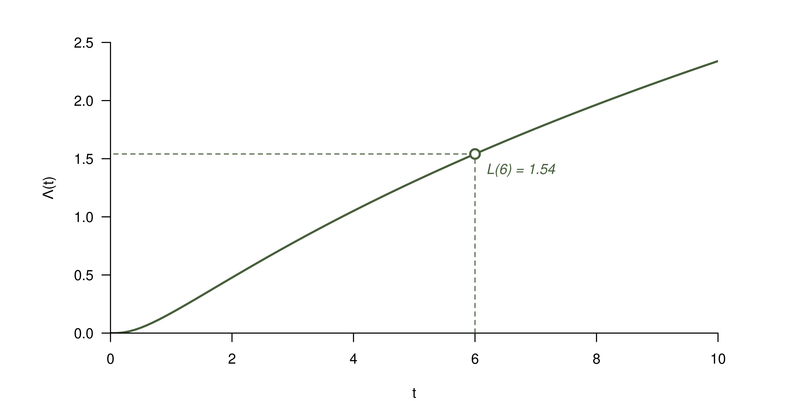
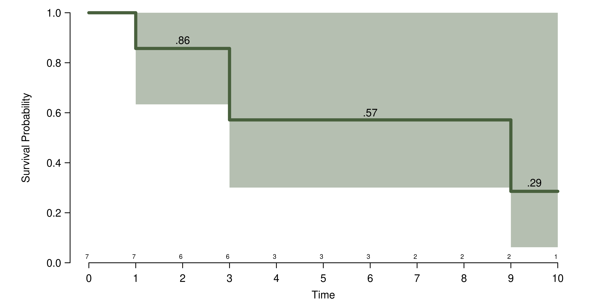
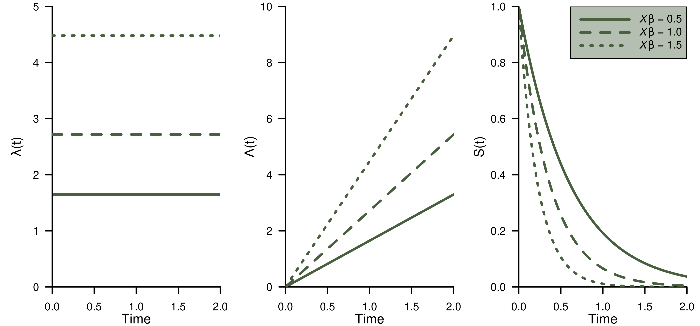

---
# The template from these slides is inspired in that from [Mark Andrews](https://github.com/mark-andrews/sips2019)
title: "Introduction to survival analysis"
# subtitle: ""
author: |
  | Jorge N. Tendeiro
  |
  | Department of Psychometrics and Statistics
  | Faculty of Behavioral and Social Sciences
  | University of Groningen
  |   
  | \faEnvelopeO\  ```j.n.tendeiro@rug.nl```
  | \faGlobe\ ```www.jorgetendeiro.com```
  | \faGithub\ ```jorgetendeiro/Seminar-2020-Survival-Analysis```
fontsize: 10pt
output:
 beamer_presentation:
 # keep_tex: true
  fonttheme: "serif"
  includes:
   in_header: include/preamble.tex
bibliography: include/references.bib
csl: 'include/apa-old-doi-prefix.csl'
nocite: |
  @forder2019hearing
---


```{r, include=FALSE}
library(Deriv)
library(ggplot2)
library(pander)
library(kableExtra)
library(pscl)
library(rms)
library(magrittr)
panderOptions('round', 3)
panderOptions('keep.trailing.zeros', TRUE)
```

# Plan for today

Gentle introduction to survival analysis.
\vfill

*Source:*\newline
Harrell, F. E., Jr. (2015). *Regression Modeling strategies*, 2nd edition. Springer

*Chapters:*\newline
17, 18, and 20.

# Survival analysis (SA)

*\alert{Data:}*\newline
For which the *time until the event* is of interest. 

- This goes beyond *logistic regression*, which focuses on the *occurrence* of the event.
\vfill

*\alert{Outcome variable:}*

- $T$ = Time until the event.
- Often referred to as *failure time*, *survival time*, or *event time*. 

# Examples

*\alert{Survival time: }* Time until\ldots

- death, desease, relapse.
\vfill

*\alert{Failure time: }* Time until\ldots

- product malfunction.
\vfill

*\alert{Event time: }* Time until\ldots

- graduation, marriage, divorce.

# Advantages of SA over typical regression models

- SA allows modeling units that did not fail up to data collection (*censored on the right* data).
```{r, echo = FALSE, out.width = '50%', fig.align = 'center'}
knitr::include_graphics("include/figures/censored.png")
```
\vfill

- Regression could be considered to model the expected survival time. *But*:
    - Survival time is often not normally distributed.
    - $P(\text{survival}>t)$ is often more interesting than $\mathbb{E}(\text{survival time})$.

# Censoring

- For some subjects, the event did not occur up to the end of data collection.
- These data are \alert{right-censored}.
\vfill

Define random variables for the $i$th subject:

- $T_i=$ time to event
- $C_i=$ censoring time
- $e_i=$ event indicator = 
$\left\{
\begin{array}{rl}
1 & \text{if event is observed ($T_i\leq C_i$)} \\
0 & \text{if event is not observed ($T_i> C_i$)}
\end{array}
\right.$ 
- $Y_i=\min(T_i, C_i)=$ what occurred first (failure or censoring)
\vfill

Variables $\{Y_i, e_i\}$ include all the necessary information.

# Typical data set

\begin{table}[t]
\begin{minipage}[t]{0.55\linewidth}\vspace{0pt}
\includegraphics[width=\linewidth]{include/figures/censored.png}
\end{minipage}
\hfill
\begin{minipage}[t]{0.30\linewidth}\vspace{0pt}
\begin{tabular}{ccgg}
\hline
$T_i$ & $C_i$ & $Y_i$ & $e_i$ \\
\hline
5   & 10 & 5  & 1 \\
4   & 12 & 4  & 1 \\
13+ & 13 & 13 & 0 \\
5   & 10 & 5  & 1 \\
15+ & 15 & 15 & 0 \\
\hline
\end{tabular}
\end{minipage}
\end{table}
\vfill

Observe the flexibility of SA data:

- Subjects may join the study at different moments.
- Censoring times may differ among subjects.
\vfill

$\{Y_i, e_i\}$ does include all the necessary information.
\vfill

But, *assumption*: Censoring is \alert{non-informative}, i.e., it is independent of the risk of the event.

# Three main functions

Recall that the outcome variable is $T=$ time until event.

- \alert{Survival function:}
$$
S(t) = P(T > t) = 1 - F(t),
$$
where $F = P(T\leq t)$ is distribution function of $T$.

- \alert{Cumulative hazard function:}
$$
\Lambda(t) = -\log(S(t))
$$
- \alert{Hazard function:}
$$
\lambda(t) = \Lambda'(t)
$$

# Survival function
$$
\fbox{$S(t) = P(T > t) = 1 - F(t)$}
$$
\vfill

*\alert{Example:}*\newline
If event $=$ death, then $S(t)=$ prob. that death occurs after time $t$.

*\alert{Properties:}*

- $S(0) = 1$, $S(\infty) = 0$.
- Non-increasing function of $t$.

```{r, echo = FALSE, out.width = '80%', fig.align = 'center'}
knitr::include_graphics("include/figures/survival_func.png")
```

# Cumulative hazard function
$$
\fbox{$\Lambda(t) = -\log(S(t))$}
$$
\vfill

*\alert{Idea:}*\newline
Accumulated risk up until time $t$.

*\alert{Properties:}*

- $\Lambda(0) = 0$.
- Non-decreasing function of $t$.

```{r, echo = FALSE, out.width = '80%', fig.align = 'center'}

```

# Hazard function
$$
\fbox{$\lambda(t) = \Lambda'(t)$}
$$
\vfill

*\alert{Idea:}*\newline
Instantaneous event rate at time $t$.
\vfill

```{r, echo = FALSE, out.width = '80%', fig.align = 'center'}
knitr::include_graphics("include/figures/hazard_func.png")
```

# Relation between the three functions

*\alert{All functions are related:}*\newline
Any two functions can be derived from the third function.

- The three functions are \alert{equivalent ways} of describing the same random variable ($T=$ time until event).
\vfill

More generally, all the following functions give mathematically equivalent specifications of the distribution of $T$:

- $F(t)$: Distribution function
- $f(t)$: Density function
- $S(t)$: Survival function
- $\lambda(t)$: Hazard function
- $\Lambda(t)$: Cumulative hazard function.

# Examples

Next are two primary examples of parametric survival distributions:

- the \alert{exponential} distribution;
- the \alert{Weibull} distribution.
\vfill

These models (still) include \alert{no} covariates, thus:

- Each subject in the sample is assumed to have the same distribution of $T$.
\vfill

No formulas.\newline
Instead: Let's plot.

# Exponential survival distribution

```{r, echo = FALSE, out.width = '100%', fig.align = 'center'}

```

# Weibull survival distribution (I)

```{r, echo = FALSE, out.width = '100%', fig.align = 'center'}

```

# Weibull survival distribution (II)

```{r, echo = FALSE, out.width = '100%', fig.align = 'center'}

```

# Quantiles

*\alert{Q:}* What is the time by which $(100q)\%$ of the population will fail?

*\alert{A:}* Value $t_q$ such that $F(t_q)=q$, or, equiv., $S(t_q)=1-q$.
\vfill

```{r, echo = FALSE, out.width = '100%', fig.align = 'center'}

```
\vfill

In particular, \alert{median} survival time = $t_{.50}$.

# Expected failure time

(Note: $T$ is skewed, so the mean is not the best summary. Better use median.)


*\alert{Q:}* What is the expected failure time?

*\alert{A:}* It is the area under the survival function.
\vfill

```{r, echo = FALSE, out.width = '100%', fig.align = 'center'}
knitr::include_graphics("include/figures/EXP_mean.png")
```

# Various estimation approaches

There are several options available to estimate the survival function (and friends).

Here we will briefly go through only a few:

- Not parametric and homogeneous (i.e., without predictors):
    - Kaplan-Meier estimator
    - Altschuler-Nelson estimator
- Parametric:
    - Homogeneous (i.e., no predictors): Exponential, Weibull, normal, logistic, log-normal, log-logistic,\ldots
    - Proportional hazards models
- Semi-parametric:
    - Cox proportional hazards regression model
\vfill

After a brief intro to each, I will use them all on an empirical dataset.

# Kaplan-Meier estimator

- Also known as the *product-limit* estimator.
- Non parametric, and super simple to do even manually.
- Key ingredient: *Conditional probabilites*.
\vfill

Assume $t = 0, 1, 2,\ldots$\newline
We have that $S(0)=P(T>0)=1$. For $t\geq 1$ we then have that 
$$ P(T > t|T>t-1) = \frac{P(T>t,T>t-1)}{P(T>t-1)} = \frac{P(T>t)}{P(T>t-1)} $$
and so
$$ P(T>t) = P(T>t-1) \times P(T>t|T>t-1), $$
or in terms of the survival function,
$$ S(t) = S(t-1) \times P(T>t|T>t-1) $$
$$ \fbox{$S(t) = S(t-1) \times (1 - P(T\leq t|T>t-1))$} $$

# Kaplan-Meier estimator -- Example

Data: Seven subjects; failure times $T = 1, 3, 3, 3+, 6+, 9, 10+$.
\vfill

\begin{center}
\footnotesize
\begin{tabular}{ccccc}
\hline
Day & No. subjects & Deaths & Censored & $S(t) = S(t-1) \times$           \\
    & at risk      &        &          & $\times (1 - P(T\leq t|T>t-1))$  \\
\hline
1   & \color{blue}{7}            & \color{red}{1}      & 0        & $1  \times (1-{\color{red}{1}}/{\color{blue}{7}}) = 6/7$                 \\
3   & $7-(1+0)=\color{blue}{6}$            & \color{red}{2}      & 1        & $6/7\times (1-{\color{red}{2}}/{\color{blue}{6}}) = 4/7$               \\
6   & $6-(2+1)=\color{blue}{3}$            & \color{red}{0}      & 1        & $4/7\times (1-{\color{red}{0}}/{\color{blue}{3}}) = 4/7$               \\
9   & $3-(0+1)=\color{blue}{2}$            & \color{red}{1}      & 0        & $4/7\times (1-{\color{red}{1}}/{\color{blue}{2}}) = 2/7$               \\
10  & $2-(1+0)=\color{blue}{1}$            & \color{red}{0}      & 1        & $2/7\times (1-{\color{red}{0}}/{\color{blue}{1}}) = 2/7$               \\
\hline
\end{tabular}
\end{center}
\vfill

Hence:
$$ 
S(t) = 
\left\{
\begin{array}{rl}
1,       & 0 \leq t < 1  \\
6/7=.86, & 1 \leq t < 3  \\
4/7=.57, & 3 \leq t < 9  \\
2/7=.29, & 9 \leq t < 10 \\
\text{undefined}^*, & t \geq 10
\end{array}.
\right.
$$

\footnotesize
$^*$Not everyone failed by $t=10$, so we cannot tell what happened after that.

# Kaplan-Meier estimator -- Example


```{r, echo = FALSE, out.width = '100%', fig.align = 'center'}

```

# Altschuler-Nelson estimator

- Non parametric, also simple.
- Similar to Kaplan-Meier, but based on $\Lambda(t)$.
\vfill

Recall that $\Lambda(t)=$ accumulated risk up until time $t$.

Hence it makes sense to estimate $\Lambda(t)$ by

$$ \widehat{\Lambda}(t) = \sum_{i:t_i\leq t} \frac{\text{\# failures at }t_i}{\text{\# subjects at risk at } t_i}. $$
\vfill

Then, 

$$ \widehat{S}(t) = \exp(-\widehat{\Lambda}(t)). $$

Interesting property: $\sum_i\widehat{\Lambda}(Y_i)=$ total number of events.

# Altschuler-Nelson estimator -- Example

Data: Seven subjects; failure times $T = 1, 3, 3, 3+, 6+, 9, 10+$.
\vfill

\begin{center}
\footnotesize
\begin{tabular}{ccccc}
\hline
Day & No. subjects & Deaths & Censored & $\Lambda(t)$   \\
    & at risk      &        &          &                \\
\hline
1   & \color{blue}{7}            & \color{red}{1}      & 0        & ${\color{red}{1}}/{\color{blue}{7}}$                 \\
3   & $7-(1+0)=\color{blue}{6}$            & \color{red}{2}      & 1        & $1/7+ {\color{red}{2}}/{\color{blue}{6}} = 10/21$               \\
6   & $6-(2+1)=\color{blue}{3}$            & \color{red}{0}      & 1        & $10/21+ {\color{red}{0}}/{\color{blue}{3}} = 10/21$               \\
9   & $3-(0+1)=\color{blue}{2}$            & \color{red}{1}      & 0        & $10/21+ {\color{red}{1}}/{\color{blue}{2}} = 41/42$               \\
10  & $2-(1+0)=\color{blue}{1}$            & \color{red}{0}      & 1        & $41/42+ {\color{red}{0}}/{\color{blue}{1}} = 41/42$               \\
\hline
& & $\sum_i={\color{red}{4}}$ & & $\sum_i={\color{red}{4}}$ 
\end{tabular}
\end{center}
\vfill

Hence:
$$ 
S(t) = \exp(-\Lambda(t)) = 
\left\{
\begin{array}{rl}
\exp(0)=1,       & 0 \leq t < 1  \\
\exp(-1/7)=.87, & 1 \leq t < 3  \\
\exp(-10/21)=.62, & 3 \leq t < 9  \\
\exp(-41/42)=.38, & 9 \leq t < 10 \\
\text{undefined}, & t \geq 10
\end{array}.
\right.
$$

# Altschuler-Nelson estimator -- Example

```{r, echo = FALSE, out.width = '100%', fig.align = 'center'}

```

# Homogeneous parametric models

*\alert{Q:}* How about *continuous*, parametric, counterparts to KM and AN?
\newline
\phantom{Q:} Still incorporating no predictors?

*\alert{A:}* There are really *a lot* of possibilities.
\vfill

Most common examples:

- Exponential
- Weibull
- Normal
- Logistic
- Log-normal
- Log-logistic
- \ldots
\vfill

*My advice:*\newline
Just fit several of these and compare.
\newline
There is no 'best' model, it depends on the data.

# Homogeneous parametric models

Data: $T = 1, 3, 3, 3+, 6+, 9, 10+$.
\vfill

```{r, echo = FALSE, out.width = '100%', fig.align = 'center'}

```

# Assessing model fit

I like Harrell's take on this:

- To assess model fit, use \alert{graphical methods}\newline
(and no tests; yeah, that's right!).
\vfill

We show an example: 
\newline
*Assess the fit of the exponential model.*
\vfill

Two plotting options, akin to $QQ$-plots:

- Plot $S^{-1}_\text{Exp}(S_\text{KM}(T))$ versus $T$;
- Plot $S_\text{Exp}(T)$ versus $S_\text{KM}(T)$.

# Assessing model fit

Data: $T = 1, 3, 3, 3+, 6+, 9, 10+$.
\vfill

```{r, echo = FALSE, out.width = '100%', fig.align = 'center'}

```

# Parametric proportional hazards model
First model until now that allows incorporating predictor variables $X=\{X_1,X_2,\ldots,X_k\}$.

- $X_i$ can be continuous, dichotomous, polytomous, etc.
\vfill

The \alert{proportional hazards (PH) model} generalizes the hazard function $\lambda(t)$:
$$
\fbox{$\lambda(t|X) = \lambda(t)\overset{\text{relative hazard function}}{\overbrace{\exp(\underset{X\beta}{\underbrace{\beta_0+\beta_1X_1+\beta_2X_2+\cdots+\beta_xX_k}})}} = \lambda(t)\exp(X\beta)$}
$$

- $\lambda(t|X)=$ hazard function for $T$ given the predictors $X$.
- $\lambda(t)=$ \alert{'underlying' hazard function} (for a subject with $X\beta=0$).
- $\exp(X\beta)$ describes the *relative* effects of the predictors.
\vfill

*Note: * The intercept $\beta_0$ may be omitted (kind of `absorbed' into $\lambda(t)$).

# Parametric proportional hazards model
$$
\fbox{$\lambda(t|X) = \lambda(t)\exp(X\beta)$}
$$
\vfill

Here are the 'friends':
\begin{align*}
\Lambda(t|X) &= \Lambda(t)\exp(X\beta) \\
S(t|X)       &= S(t)^{\exp(X\beta)}
\end{align*}

- $\Lambda(t)=$ \alert{'underlying' cumulative hazard function} (for a subject with $X\beta=0$).
- $S(t)=$ \alert{'underlying' survival function} (for a subject with $X\beta=0$).

# Parametric proportional hazards model
It is easiest to consider the log-model versions:
\begin{alignat*}{2}
\log\lambda(t|X) &= \log\lambda(t) & &+ X\beta \\
\log\Lambda(t|X) &= \log\Lambda(t) & &+ X\beta \\
\log S(t|X)      &= \underset{\text{time}}{\underbrace{\log S(t)}} & &\times \underset{\text{predictors}}{\underbrace{\exp(X\beta)}}
\end{alignat*}

- Observe that we separated the \alert{time} and the \alert{predictors} components.
\vfill

Important consequence due to the separability of $t$ and $X$:

- The effect of $X$ is assumed to be the same at all values of $t$.
- I.e.: We assume no $t\times X$ interaction effect.

# Parametric proportional hazards model
How to interpret regression coefficient $\beta_j$ ($j=1,\ldots,k$)?
\vfill

\begin{alignat*}{2}
\log\lambda(t|X) &= \log\lambda(t) & &+ (\beta_0+\beta_1X_1+\beta_2X_2+\cdots+\beta_xX_k) \\
\log\Lambda(t|X) &= \underset{\text{time}}{\underbrace{\log\Lambda(t)}} & &+ \underset{\text{predictors}}{\underbrace{(\beta_0+\beta_1X_1+\beta_2X_2+\cdots+\beta_xX_k)}}
\end{alignat*}
\vfill

- \alert{Additive} interpretation: 
    - $\log\lambda(t|X)$ increases by $\beta_j$ units when $X_j$ increases by 1 unit \alert{at any time point} $t$, holding all the other predictors constant:
    $$\log\lambda(t|\ldots,X_j+1,\ldots) = \log\lambda(t|\ldots,X_j,\ldots) \alert{+ \beta_j}.$$
    - Same for $\log\lambda(t|X)$.

# Parametric proportional hazards model
How to interpret regression coefficient $\beta_j$ ($j=1,\ldots,k$)?
\vfill

\begin{alignat*}{2}
\lambda(t|X) &= \lambda(t) & &\times \exp(\beta_0+\beta_1X_1+\beta_2X_2+\cdots+\beta_xX_k) \\
\Lambda(t|X) &= \Lambda(t) & &\times \exp(\beta_0+\beta_1X_1+\beta_2X_2+\cdots+\beta_xX_k) \\
\log S(t|X)  &= \underset{\text{time}}{\underbrace{\log S(t)}}      & &\times\underset{\text{predictors}}{\underbrace{\exp(\beta_0+\beta_1X_1+\beta_2X_2+\cdots+\beta_xX_k)}}
\end{alignat*}
\vfill

- \alert{Multiplicative} interpretation: 
    - $\lambda(t|X)$ is multiplied by $\exp(\beta_j)$ units when $X_j$ increases by 1 unit \alert{at any time point} $t$, holding all the other predictors constant:
    $$\frac{\lambda(t|\ldots,X_j+1,\ldots)}{\lambda(t|\ldots,X_j,\ldots)} = \exp(\beta_j).$$
    - Same for $\lambda(t|X)$.
    - Same for $\log S(t|X)$.

# Example: Exponential PH survival model
$X\beta = \beta_0+\beta_1X_1+\beta_2X_2+\cdots+\beta_xX_k$.

\begin{align*}
\lambda(t|X) &= \exp(X\beta) \\
\Lambda(t|X) &= t\exp(X\beta) \\
S(t|X)       &= \exp(-t)^{\exp(X\beta)}
\end{align*}
\vfill

```{r, echo = FALSE, out.width = '100%', fig.align = 'center'}

```

# Example: Weibull PH survival model
$X\beta = \beta_0+\beta_1X_1+\beta_2X_2+\cdots+\beta_xX_k$.

\begin{align*}
\lambda(t|X) &= \gamma t^{\gamma-1}\exp(X\beta) \\
\Lambda(t|X) &= t^\gamma\exp(X\beta) \\
S(t|X)       &= \exp(-t^\gamma)^{\exp(X\beta)}
\end{align*}
\vfill


