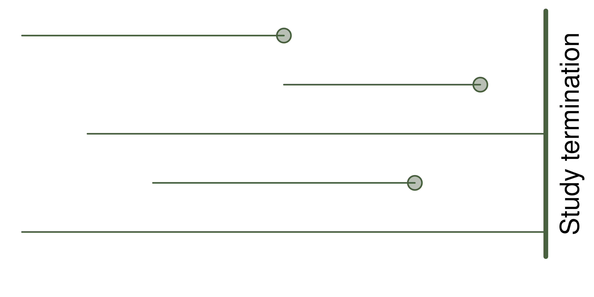

---
# The template from these slides is inspired in that from [Mark Andrews](https://github.com/mark-andrews/sips2019)
title: "Introduction to survival analysis"
# subtitle: ""
author: |
  | Jorge N. Tendeiro
  |
  | Department of Psychometrics and Statistics
  | Faculty of Behavioral and Social Sciences
  | University of Groningen
  |   
  | \faEnvelopeO\  ```j.n.tendeiro@rug.nl```
  | \faGlobe\ ```www.jorgetendeiro.com```
  | \faGithub\ ```jorgetendeiro/Seminar-2020-Survival-Analysis```
fontsize: 10pt
output:
 beamer_presentation:
 # keep_tex: true
  fonttheme: "serif"
  includes:
   in_header: include/preamble.tex
bibliography: include/references.bib
csl: 'include/apa-old-doi-prefix.csl'
nocite: |
  @forder2019hearing
---


```{r, include=FALSE}
library(Deriv)
library(ggplot2)
library(pander)
library(kableExtra)
library(pscl)
panderOptions('round', 3)
panderOptions('keep.trailing.zeros', TRUE)
```

# Plan for today

Gentle introduction to survival analysis.
\vfill

*Source:*\newline
Harrell, F. E., Jr. (2015). *Regression Modeling strategies*, 2nd edition. Springer

*Chapters:*\newline
17, 18, and 20.

# Survival analysis (SA)

*\alert{Data:}*\newline
For which the *time until the event* is of interest. 

- This goes beyond *logistic regression*, which focuses on the *occurrence* of the event.
\vfill

*\alert{Outcome variable:}*

- $T$ = Time until the event.
- Often referred to as *failure time*, *survival time*, or *event time*. 

# Examples

*\alert{Survival time: }* Time until\ldots

- death, desease, relapse.
\vfill

*\alert{Failure time: }* Time until\ldots

- product malfunction.
\vfill

*\alert{Event time: }* Time until\ldots

- graduation, marriage, divorce.

# Advantages of SA over typical regression models

- SA allows modeling units that did not fail up to data collection (*censored on the right* data).
```{r, echo = FALSE, out.width = '50%', fig.align = 'center'}

```
\vfill

- Regression could be considered to model the expected survival time. *But*:
    - Survival time is often not normally distributed.
    - $P(\text{survival}>t)$ is often more interesting than $\mathbb{E}(\text{survival time})$.

# Censoring

We focus on 

# Three main functions

Recall that the outcome variable is $T=$ time until event.

- \alert{Survival function:}
$$
S(t) = P(T > t) = 1 - F(t),
$$
where $F = P(T\leq t)$ is distribution function of $T$.

- \alert{Cumulative hazard function:}
$$
\Lambda(t) = -\log(S(t))
$$
- \alert{Hazard function:}
$$
\lambda(t) = \Lambda'(t)
$$

# Survival function
$$
\fbox{$S(t) = P(T > t) = 1 - F(t)$}
$$
\vfill

*\alert{Example:}*\newline
If event $=$ death, then $S(t)=$ prob. that death occurs after time $t$.

*\alert{Properties:}*

- $S(0) = 1$, $S(\infty) = 0$.
- Non-increasing function of $t$.

```{r, echo = FALSE, out.width = '80%', fig.align = 'center'}

```

# Cumulative hazard function
$$
\fbox{$\Lambda(t) = -\log(S(t))$}
$$
\vfill

*\alert{Idea:}*\newline
Accumulated risk up until time $t$.

*\alert{Properties:}*

- $\Lambda(0) = 0$.
- Non-decreasing function of $t$.

```{r, echo = FALSE, out.width = '80%', fig.align = 'center'}
knitr::include_graphics("include/figures/cum_hazard_func.png")
```

# Hazard function
$$
\fbox{$\lambda(t) = \Lambda'(t)$}
$$
\vfill

*\alert{Idea:}*\newline
Instantaneous event rate at time $t$.
\vfill

```{r, echo = FALSE, out.width = '80%', fig.align = 'center'}

```

# Relation between the three functions

*\alert{All functions are related:}*\newline
Any two functions can be derived from the third function.

- The three functions are \alert{equivalent ways} of describing the same random variable ($T=$ time until event).
\vfill

More generally, all the following functions give mathematically equivalent specifications of the distribution of $T$:

- $F(t)$: Distribution function
- $f(t)$: Density function
- $S(t)$: Survival function
- $\lambda(t)$: Hazard function
- $\Lambda(t)$: Cumulative hazard function.

# Examples

Next are two primary examples of parametric survival distributions:

- the \alert{exponential} distribution;
- the \alert{Weibull} distribution.
\vfill

These models (still) include \alert{no} covariates, thus:

- Each subject in the sample is assumed to have the same distribution of $T$.
\vfill

No formulas.\newline
Instead: Let's plot.

# Exponential survival distribution

```{r, echo = FALSE, out.width = '100%', fig.align = 'center'}
knitr::include_graphics("include/figures/EXP_survival_dist.png")
```

# Weibull survival distribution (I)

```{r, echo = FALSE, out.width = '100%', fig.align = 'center'}
knitr::include_graphics("include/figures/WEIBULL_survival_dist.png")
```

# Weibull survival distribution (II)

```{r, echo = FALSE, out.width = '100%', fig.align = 'center'}
knitr::include_graphics("include/figures/WEIBULL2_survival_dist.png")
```

# Quantiles

*\alert{Q:}* What is the time by which $(100q)\%$ of the population will fail?

*\alert{A:}* Value $t_q$ such that $F(t_q)=q$, or, equiv., $S(t_q)=1-q$.
\vfill

```{r, echo = FALSE, out.width = '100%', fig.align = 'center'}
knitr::include_graphics("include/figures/EXP_quantile.png")
```
\vfill

In particular, \alert{median} survival time = $t_{.50}$.

# Expected failure time

(Note: $T$ is skewed, so the mean is not the best summary. Better use median.)


*\alert{Q:}* What is the expected failure time?

*\alert{A:}* It is the area under the survival function.
\vfill

```{r, echo = FALSE, out.width = '100%', fig.align = 'center'}

```


